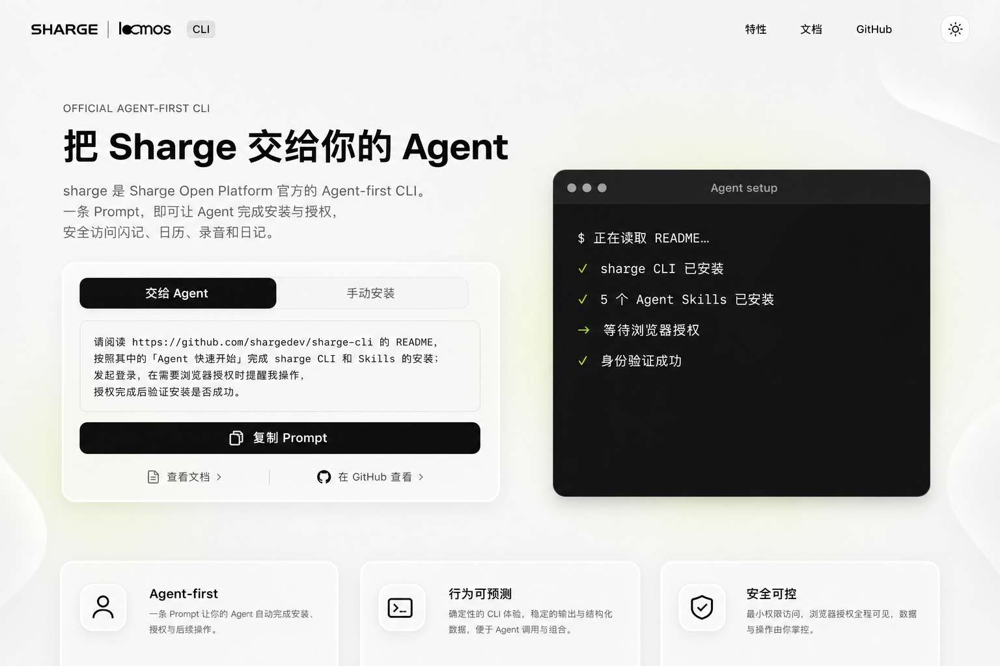
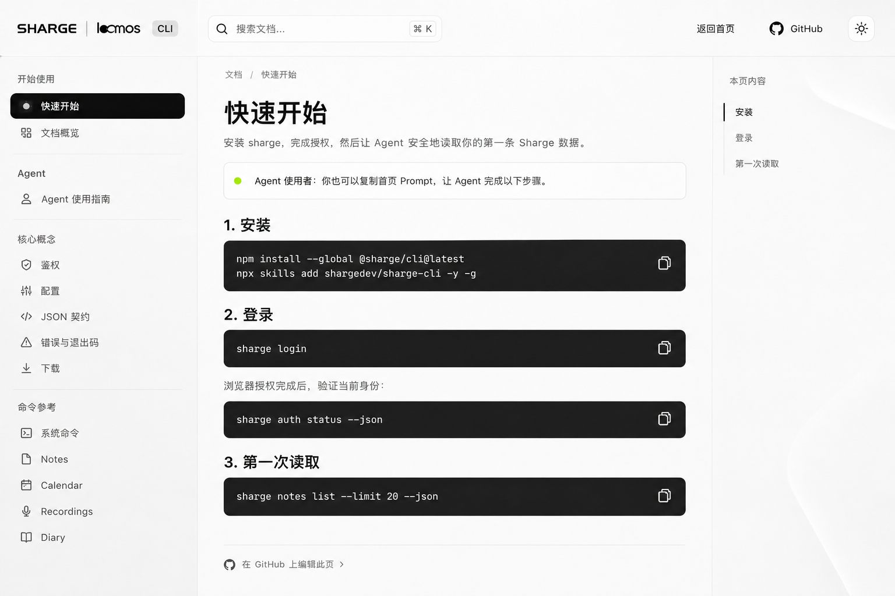

# sharge CLI 落地页与文档站规格

状态：需求已对齐，待实现

首版语言：简体中文

部署目标：`https://shargedev.github.io/sharge-cli/`

## 1. 摘要

为 `sharge` CLI 建设一个静态官网，包括品牌落地页和用户文档站。站点延续 Sharge Web 的视觉语言，但保持代码独立，以 GitHub Pages 发布。

站点最重要的产品动作不是展示一条传统安装命令，而是让访问者复制一句 Prompt 给 Agent。Agent 读取 GitHub README 中的「Agent 快速开始」，安装 CLI 与 Skills，发起登录，在需要浏览器授权时提醒人类操作，并在授权后验证安装。

首页同时保留手动安装路径。文档站面向人类使用者与 Agent 构建者，根目录 [`docs/`](../docs/README.md) 继续作为唯一文档内容源。

## 2. 背景

`sharge` 是 Sharge Open Platform 的官方 Agent-first CLI，当前覆盖 Quick Note、Calendar、Recordings 和 Diary，并提供机器可读 help、稳定 JSON 契约、显式 dry run、安全下载与可恢复错误。

仓库已经具备较完整的 Markdown 用户文档，但缺少：

- 能快速解释产品定位的公开落地页；
- 适合连续阅读、导航和搜索的在线文档；
- 从“了解项目”直接进入“让 Agent 完成安装”的 AI Native 转化路径；
- 与 Sharge Web 一致的公开开发者品牌表面；
- 自动发布到 GitHub Pages 的站点工作流。

## 3. 目标

### 3.1 产品目标

1. 访问者在 30 秒内理解 `sharge` 是什么、能访问哪些 Sharge 数据、为什么适合 Agent。
2. 访问者可以复制一句 Prompt，让 Agent 完成 CLI、Skills、登录与验证流程。
3. 不使用 Agent 的访问者也可以在同一位置复制完整的手动安装命令。
4. 新用户可以在 3 分钟内从文档进入第一次安全读取。
5. 已有用户可以通过导航和全文搜索快速找到命令与行为契约。

### 3.2 工程目标

1. 生成纯静态输出，适配项目级 GitHub Pages 的 `/sharge-cli` base path。
2. `docs/` 保持唯一内容源，不维护第二套手写 Markdown。
3. 站点依赖与 CLI 发布依赖隔离。
4. 支持浅色、深色、移动端、键盘操作和 reduced motion。
5. 在 Pull Request 中验证构建、内部链接、关键文案和公开路由。

## 4. 非目标

首版不包括：

- 英文站点或语言切换器；
- 博客、路线图、用户案例、贡献者墙或动态 Changelog 页面；
- 历史版本文档与版本切换器；
- 第三方站点分析、Cookie、广告或行为追踪；
- CMS、服务端渲染、登录态或在线 API 调用；
- 在线 CLI Playground；
- 独立 Figma 文件；
- 与 `web-app` 共享 React 组件或建立跨仓库运行时依赖；
- 把贡献指南、内部架构、OpenAPI 开发契约、测试或发布流程纳入文档主导航；
- PR 独立预览环境。

## 5. 主要受众与任务

### 5.1 正在评估 sharge 的 Agent 构建者

他们需要快速判断：

- 这个工具是否官方；
- Agent 能访问哪些 Sharge 数据；
- 安装与授权需要自己完成多少工作；
- 写入、删除、重试和凭证处理是否安全；
- 如何把工具交给 Agent，而不是手工学习所有命令。

### 5.2 首次安装的使用者

他们需要：

- 一次复制完整安装路径；
- 明确知道浏览器授权必须由人类完成；
- 在授权后得到可验证的成功状态；
- 完成第一次读取。

### 5.3 已有 CLI 用户

他们需要：

- 搜索具体命令、参数、scope、错误和输出契约；
- 在 Notes、Calendar、Recordings、Diary 与系统命令之间快速导航；
- 从网页回到 GitHub 原始文档修正问题。

## 6. 体验原则

1. **Prompt 是产品入口。** 首页最重要的可操作对象是可复制的 Agent Prompt。
2. **README 是安装事实源。** Prompt 引导 Agent 阅读 GitHub README，不复制一套隐藏安装协议。
3. **人类保留控制。** 登录流程必须明确停在浏览器授权处，等待人类操作。
4. **安全行为可见。** 最小权限、dry run、一次请求、不自动重试和 unknown outcome 是价值表达的一部分。
5. **视觉延续，代码独立。** 复用品牌资产与设计语言，不复用 Web App 运行时组件。
6. **内容先于装饰。** 首页围绕 Prompt 与终端执行路径建立视觉层级；文档页优先保证扫描和阅读。
7. **静态优先。** 不为可由 HTML、CSS 和少量 TypeScript 完成的体验引入客户端框架。

## 7. 信息架构与路由

站点挂载于 `/sharge-cli/`。

| 路由 | 页面 | 内容源 |
| --- | --- | --- |
| `/` | 落地页 | `website/src/pages/index.astro` |
| `/docs/` | 文档概览 | `docs/README.md` |
| `/docs/getting-started/` | 快速开始 | `docs/getting-started.md` |
| `/docs/agent-guide/` | Agent 使用指南 | `docs/agent-guide.md` |
| `/docs/authentication/` | 鉴权 | `docs/authentication.md` |
| `/docs/configuration/` | 配置 | `docs/configuration.md` |
| `/docs/json-contract/` | JSON 契约 | `docs/json-contract.md` |
| `/docs/errors/` | 错误与退出码 | `docs/errors.md` |
| `/docs/downloads/` | 下载 | `docs/downloads.md` |
| `/docs/commands/` | 命令参考概览 | `docs/commands/README.md` |
| `/docs/commands/system/` | 系统命令 | `docs/commands/system.md` |
| `/docs/commands/notes/` | Notes | `docs/commands/notes.md` |
| `/docs/commands/calendar/` | Calendar | `docs/commands/calendar.md` |
| `/docs/commands/recordings/` | Recordings | `docs/commands/recordings.md` |
| `/docs/commands/diary/` | Diary | `docs/commands/diary.md` |

未知路径显示自定义 404，并提供返回首页、进入文档和前往 GitHub 三个恢复入口。

## 8. 落地页规格

### 8.1 顶部导航

左侧：

- 现有 SHARGE Logo；
- 与 Logo 分离的 `CLI` 文字标记。

右侧：

- `特性`：页内锚点；
- `文档`：进入 `/docs/`；
- `GitHub`：进入 `https://github.com/shargedev/sharge-cli`；
- 主题切换。

移动端收起非关键导航，但必须保留 Logo、文档入口、GitHub 入口与主题切换。

### 8.2 Hero

主标题固定为：

> 把 Sharge 交给你的 Agent

说明固定为：

> sharge 是 Sharge Open Platform 官方的 Agent-first CLI。一条 Prompt，即可让 Agent 完成安装与授权，安全访问闪记、日历、录音和日记。

Hero 的主要操作对象是安装卡；终端执行演示是第二视觉锚点。桌面端可以并排，窄屏必须先展示标题与安装卡，再展示终端。

### 8.3 安装卡

安装卡包含两个 Tab。

#### 交给 Agent

默认选中。Prompt 必须逐字保持为：

> 请阅读 https://github.com/shargedev/sharge-cli 的 README，按照其中的「Agent 快速开始」完成 sharge CLI 和 Skills 的安装；发起登录，在需要浏览器授权时提醒我操作，授权完成后验证安装是否成功。

行为：

- `复制 Prompt` 复制纯文本，不附加引号、Markdown 或追踪参数；
- 成功后按钮文案短暂变为 `已复制`，同时使用非颜色状态提示；
- 复制失败时保留可选择文本，并显示简短错误；
- Prompt 的 GitHub URL 必须是绝对 URL，不受 Pages base path 影响。

#### 手动安装

显示一个可整体复制的命令块：

```sh
npm install --global @sharge/cli@latest
npx skills add shargedev/sharge-cli -y -g
sharge login
sharge auth status --json
```

两个 Tab 的完成标准一致：安装 CLI、安装 Skills、登录并验证身份。

### 8.4 终端演示

终端按顺序表达：

1. 正在读取 README；
2. CLI 安装完成；
3. 五个 Agent Skills 安装完成；
4. 等待人类浏览器授权；
5. 身份验证成功。

要求：

- 第一次进入视口时自动播放一次；
- 提供 `重新播放`；
- 不模拟无法取消的真实命令执行；
- 不显示真实用户名、设备名、token、API Key、请求 ID 或个人数据；
- `prefers-reduced-motion: reduce` 下直接展示最终静态状态；
- 文本从一开始就存在于可访问树中，不将信息只交给动画。

### 8.5 后续内容

按以下顺序组织：

1. 三个核心特性：Agent-first、行为可预测、安全可控；
2. 四类能力：Notes、Calendar、Recordings、Diary；
3. 安全工作流：发现命令、dry run、人类确认、执行、结果恢复；
4. 第二次 CTA：复制 Prompt 或进入文档；
5. Footer：GitHub、npm、License、Changelog。

不加入产品截图。能力卡使用已有产品图标或简洁线性图标，不生成伪产品 UI。

## 9. 文档站规格

### 9.1 导航

侧边栏分组：

1. 开始使用
   - 文档概览
   - 快速开始
2. Agent
   - Agent 使用指南
3. 核心概念
   - 鉴权
   - 配置
   - JSON 契约
   - 错误与退出码
   - 下载
4. 命令参考
   - 命令概览
   - 系统命令
   - Notes
   - Calendar
   - Recordings
   - Diary

文档页保留面包屑、当前页目录、上一页/下一页导航和 `在 GitHub 上编辑此页`。

### 9.2 内容边界

公开站点只展示使用者文档。以下内容不进入主导航：

- `CONTRIBUTING.md`；
- `contracts/`；
- 内部架构和 ADR；
- 测试、E2E 和发布流程；
- Agent Skill 维护说明。

Footer 可以链接贡献指南和仓库 Issue。

### 9.3 内容转换

- 为现有公开 Markdown 补充最小 frontmatter：`title`、`description`，必要时增加导航元数据；
- 不为网站复制或重写正文；
- 构建时将 `docs/README.md` 映射为 `/docs/`；
- 将 `docs/commands/README.md` 映射为 `/docs/commands/`；
- 构建阶段重写站内 `.md` 链接为 Pages 路由；GitHub 中的原始 Markdown 链接继续可用；
- CLI 命令、参数和公共行为仍以 `src/cli/definitions.ts` 与 CLI help 为最终事实源；
- 网页不得展示尚未实现或未出现在 CLI help 中的命令。

### 9.4 搜索

- 使用 Starlight 默认的 Pagefind 静态全文搜索；
- 仅索引公开文档正文、标题与描述；
- 排除导航、Footer、安装卡重复内容和生成式终端演示；
- 搜索无需第三方服务、Cookie 或网络请求；
- 支持键盘快捷键和完整键盘导航。

### 9.5 版本

首版仅展示 latest 文档，不提供历史版本切换器。当前版本在构建时从根目录 `package.json` 读取，并链接 `CHANGELOG.md`；不得运行时请求 npm registry。

## 10. 主题与响应式

### 10.1 主题

- 支持浅色和深色；
- 初次访问跟随系统；
- 用户选择持久化到本地；
- 主题脚本必须在首次绘制前应用，避免闪烁；
- 深浅主题保持相同的信息层级，不把深色主题变成高饱和霓虹风格；
- 青柠绿只用于成功、已连接或进度完成，并配合图标或文字。

### 10.2 断点行为

- 桌面：12 列内容网格；Hero 双列；文档三栏；
- 平板：6 列；Hero 可双列或紧凑堆叠；文档目录移入浮层；
- 手机：4 列；所有内容单列；文档侧栏使用可关闭抽屉；
- 不通过缩小正文到难读尺寸来保持桌面结构；
- 不隐藏横向溢出来掩盖布局错误。

## 11. 技术方案

### 11.1 技术栈

- Astro：静态页面、组件和构建；
- Starlight：文档路由、导航、目录、SEO、代码高亮、主题和 Pagefind；
- Tailwind CSS v4：站点布局与视觉实现；
- Astro 组件与少量原生 TypeScript：Tab、复制、主题和终端演示；
- GitHub Actions + GitHub Pages：构建与发布；
- npm：与当前 CLI 仓库保持一致。

不引入 React、Next.js、Docusaurus、客户端路由、服务端 adapter、图表库、图标运行时或第三方分析 SDK。

### 11.2 仓库结构

建议结构：

```text
sharge-cli/
├── DESIGN.md
├── specs/
│   ├── sharge-cli-website.md
│   └── assets/
├── docs/                         # 唯一文档内容源
├── website/
│   ├── package.json
│   ├── package-lock.json
│   ├── astro.config.mjs
│   ├── tsconfig.json
│   ├── public/
│   └── src/
│       ├── components/
│       ├── layouts/
│       ├── pages/
│       │   ├── index.astro
│       │   └── 404.astro
│       ├── styles/
│       │   ├── tokens.css
│       │   └── global.css
│       └── content.config.ts     # 直接加载仓库根 docs/
└── .github/workflows/pages.yml
```

站点使用独立 `package.json` 与 lockfile。根 npm 包不得把 Astro/Starlight 加入 CLI 运行时依赖，npm tarball 也不得包含 `website/` 构建产物。

### 11.3 内容加载

`website/src/content.config.ts` 使用 Astro Content Collection 加载仓库根目录 `docs/`，并通过 Starlight schema 校验 frontmatter。Loader 必须生成稳定的 `/docs/**` ID，处理两个 `README.md` 的 index 映射。

如果 Starlight 当前版本无法可靠监听仓库外目录，可以在构建前生成一个被 gitignore 的镜像目录；该目录只能由脚本生成，不能成为第二个手写内容源。

### 11.4 GitHub Pages

Astro 配置：

- `site: 'https://shargedev.github.io'`；
- `base: '/sharge-cli'`；
- 静态输出；
- 所有内部链接和资源路径必须经过 Astro base path API 生成，不硬编码根路径。

工作流：

- Pull Request：安装站点依赖，执行站点验证与静态构建，不发布；
- `main` push：构建、上传 Pages artifact、部署到 `github-pages` environment；
- 支持 `workflow_dispatch`；
- 只有站点、公开文档、相关根元数据或工作流变化时触发站点任务。

## 12. 仓库公开入口更新

上线时同步：

- README 顶部加入官网与在线文档；
- `package.json.homepage` 改为 Pages 地址；
- GitHub 仓库 Website 字段指向 Pages；
- README 保持 Agent 安装事实源；
- 不把首页 Prompt 改为读取网页文档。

GitHub Website 字段是仓库设置操作，不由代码提交自动完成。

## 13. SEO 与隐私

- 每页必须有唯一标题、描述、canonical URL 和 Open Graph 元数据；
- 生成 sitemap 与 robots.txt；
- 首页 OG 图使用品牌化静态资产，不把 UI 视觉稿直接作为生产 OG 图；
- 不加载第三方分析、广告、聊天组件或追踪像素；
- 不在页面、构建日志或示例中放入凭证、真实账号或用户数据；
- 外部链接使用明确标签，必要时添加安全的 `rel` 属性。

## 14. 验证策略

### 14.1 自动检查

站点至少提供：

```sh
npm --prefix website ci
npm --prefix website run typecheck
npm --prefix website run check
npm --prefix website run build
```

检查范围：

- Astro/Starlight 类型和内容 schema；
- 所有内部链接和 base-path 资源；
- 关键公开路由；
- 首页 Prompt 逐字一致；
- 手动安装命令逐字一致；
- 文档侧边栏只包含允许的公开文档；
- Pagefind 索引成功生成；
- npm tarball 不包含站点输出；
- 站点源码不包含第三方分析或真实凭证。

### 14.2 视觉与交互检查

实现后至少检查：

- 桌面浅色；
- 桌面深色；
- 手机浅色；
- 手机深色；
- 键盘导航与可见焦点；
- reduced motion；
- 长中文标题、长 Prompt 与代码横向滚动；
- GitHub Pages `/sharge-cli` 子路径；
- 复制成功与失败；
- 文档搜索与 404 恢复。

视觉实现以 [`DESIGN.md`](../DESIGN.md) 为设计权威。

## 15. 验收标准

以下条件全部满足时，首版可以发布：

1. `https://shargedev.github.io/sharge-cli/` 可访问，刷新任一文档深层路由不会丢失资源。
2. 首页主标题、说明、Agent Prompt 和手动安装命令与本规格逐字一致。
3. Agent Prompt 默认可见，并可以通过一次操作复制。
4. 登录路径明确要求人类完成浏览器授权。
5. 终端演示在 reduced motion 下不播放动画，但信息完整。
6. 首页包含三类核心特性、四类能力、安全工作流和第二 CTA。
7. 文档站只渲染允许的公开用户文档，导航与当前 CLI 能力一致。
8. 搜索可以离线索引和查询公开文档。
9. 每个文档页可以跳转到 GitHub 原始 Markdown。
10. 深浅主题均可用，首次跟随系统，用户选择可以持久化。
11. 手机、键盘和屏幕阅读器用户可以完成安装信息复制与文档导航。
12. 站点无第三方分析、Cookie banner 或运行时 API 依赖。
13. Pull Request 站点检查通过，`main` 合并后 Pages 自动发布。
14. 根 README、npm homepage 与 GitHub Website 入口完成更新。

## 16. 视觉参考

视觉稿用于表达构图和层级，不是像素级实现来源；图片中的生成式文字误差不得进入生产页面。

### 落地页浅色桌面稿



### 文档页浅色桌面稿



## 17. 风险与处理

| 风险 | 处理 |
| --- | --- |
| 根 `docs/` 不在 Starlight 默认内容目录 | 使用外部 content loader；必要时退化为构建期生成镜像，不产生第二份手写来源 |
| Markdown 的 `.md` 相对链接在网站失效 | 构建期统一重写并增加链接检查 |
| GitHub Pages base path 导致资源或深链错误 | 所有路径通过 Astro base API 生成，在 CI 中对 `/sharge-cli` 构建结果做检查 |
| 深色主题变成独立视觉系统 | 使用同一语义 token 与层级，仅替换颜色值和阴影强度 |
| 动画妨碍阅读或无障碍 | 内容不依赖动画，支持 reduced motion 和手动重播 |
| 官网命令与 CLI 漂移 | 关键命令来自当前公开文档并加入内容契约测试；行为变更继续遵循文档优先流程 |
| 视觉稿的生成式文字被误当作事实 | 生产实现只使用本规格和仓库文档中的原文 |

## Source Manifest

### Sources

- 用户在本任务中逐项确认的受众、Prompt、信息架构、内容边界、技术栈、部署、主题、隐私和验收方向。
- [`README.md`](../README.md)：项目定位、Agent 快速开始、命令概览与安全说明。
- [`docs/README.md`](../docs/README.md)：公开文档范围与核心保证。
- [`docs/getting-started.md`](../docs/getting-started.md)：安装、登录与首次读取流程。
- [`src/cli/definitions.ts`](../src/cli/definitions.ts)：公开命令定义事实源。
- Sharge Web 本地源码中的 `src/main.css`、Logo、登录、侧边栏与 CLI 授权页面：视觉语言来源；站点不建立源码依赖。
- [Vercel design.md](https://vercel.com/design.md)：仅作为设计规范的信息组织与执行约束参考。
- [`specs/assets/website-landing-light-v1.png`](./assets/website-landing-light-v1.png)：ImageGen 落地页视觉稿。
- [`specs/assets/website-docs-light-v1.png`](./assets/website-docs-light-v1.png)：ImageGen 文档页视觉稿。

### Produced artifacts

- [`specs/sharge-cli-website.md`](./sharge-cli-website.md)
- [`DESIGN.md`](../DESIGN.md)
- [`specs/assets/website-landing-light-v1.png`](./assets/website-landing-light-v1.png)
- [`specs/assets/website-docs-light-v1.png`](./assets/website-docs-light-v1.png)

### Key decisions

- Astro + Starlight + Tailwind CSS v4，纯静态 GitHub Pages。
- 首页以 Agent Prompt 为默认主入口，手动安装通过 Tab 提供。
- `docs/` 是唯一文档内容源，网站只负责展示、导航和搜索。
- 首版中文、latest-only、无第三方分析，支持深浅主题与移动端。
- 复用视觉语言和品牌资产，不共享 Web App 组件代码。

### Verification evidence

- 需求通过逐项问答确认。
- 已检查 CLI README、文档目录、站点缺失状态、现有 GitHub workflows 与 Web App 视觉 token/页面。
- 已生成并人工检查两张 1536 × 1024 视觉稿。
- 本文件创建阶段仅验证规范一致性；站点尚未实现，构建与浏览器验收未执行。

### Open questions / risks

- GitHub 仓库 Pages Source 与 Website 字段需要仓库管理员在实现发布时确认或设置。
- 外部 `docs/` Content Collection 的开发态监听能力需要在实现首个切片时验证。
- 深色与移动端视觉稿尚未生成；实现时必须按 `DESIGN.md` 和本规格完成四种基线截图验收。
